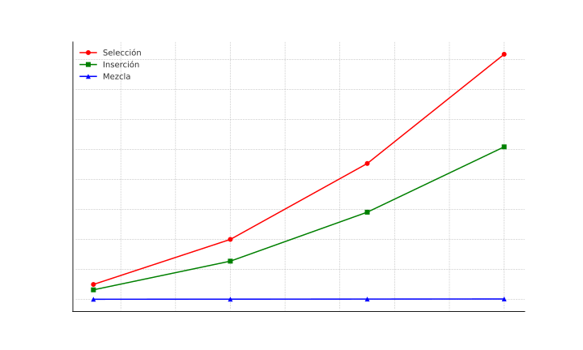

# Tarea Programada I

Esta tarea consta de tres algoritmos, seleccion, insercion y mezcla, los cuales fueron sometidos a pruebas para observar cual es el comportamiento de estos para llegar a ciertas conclusiones.

## Algoritmos Implementados
### Seleccion
```
SELECTION-SORT(A, n)
1 for i = 1 to n - 1
2     // Select smallest in A[i..n] and swap it with A[i]
3     m = i
4     for j = i + 1 to n
5         if A[j] < A[m]
6             m = j
7     swap(A[i], A[m])
```

### Insercion 
```
INSERTION-SORT(A)
1 for j = 2 to A.length
2   key = A[j]
3   // Insert A[j] into the sorted sequence A[1..j - 1].
4   i = j - 1
5   while i > 0 and A[i] > key
6       A[i + 1] = A[i]
7       i = i - 1
8   A[i + 1] = key
```

### Merge
```
MERGE(A, p, q, r)

1   n1 = q - p + 1
2   n2 = r - q
3   let L[1..n1 + 1] and R[1..n2 + 1] be new arrays
4   for i = 1 to n1
5       L[i] = A[p + i - 1]
6   for j = 1 to n2
7       R[j] = A[q + j]
8   L[n1 + 1] = ∞
9   R[n2 + 1] = ∞
10  i = 1
11  j = 1
12  for k = p to r
13      if L[i] ≤ R[j]
14          A[k] = L[i]
15          i = i + 1
16      else A[k] = R[j]
17          j = j + 1


MERGE-SORT(A, p, r)

1 if p < r
2   q = [(p + r) / 2]
3   MERGE-SORT(A, p, q)
4   MERGE-SORT(A, q + 1, r)
5   MERGE(A, p, q, r)

```
Estos pseudocodigos fueron obtenidos del libro Introduction to Algorithms, IV ed. MIT Press, 2022, teniendo como autores a Cormen, T. H., Leiserson, C. E., Rivest, R. L. y Stein, C., todo el codigo fue implementado tomando como base el pseudocodigo 

### Pruebas

Para la realizacion de pruebas se hizo un main en el cual cambiando la constante creada ```const int tam_arreglo``` por los valores de prueba que son 50000, 100000, 150000, y 200000.
### Grafica de resultados de las pruebas



### Compilacion
```
g++ main.cpp -o miPrograma
.\miPrograma
```
### Creditos 
- Andres Murillo Murillo 
- Carnet: C15424
