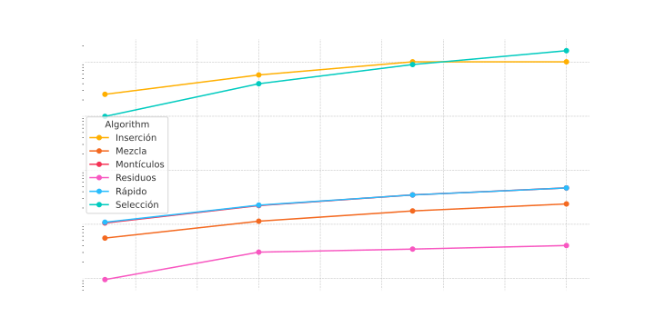

# Tarea Programada I, Entrega II

Esta tarea consta de seis algoritmos, seleccion, insercion y mezcla, rapido, residuos y monticulos, los cuales fueron sometidos a pruebas para observar cual es el comportamiento de estos para llegar a ciertas conclusiones.

## Algoritmos Implementados
### SELECCION
```
SELECTION-SORT(A, n)
1 for i = 1 to n - 1
2     // Select smallest in A[i..n] and swap it with A[i]
3     m = i
4     for j = i + 1 to n
5         if A[j] < A[m]
6             m = j
7     swap(A[i], A[m])
```

### INSERCION 
```
INSERTION-SORT(A)
1 for j = 2 to A.length
2   key = A[j]
3   // Insert A[j] into the sorted sequence A[1..j - 1].
4   i = j - 1
5   while i > 0 and A[i] > key
6       A[i + 1] = A[i]
7       i = i - 1
8   A[i + 1] = key
```

### MERGE
```
MERGE(A, p, q, r)

1   n1 = q - p + 1
2   n2 = r - q
3   let L[1..n1 + 1] and R[1..n2 + 1] be new arrays
4   for i = 1 to n1
5       L[i] = A[p + i - 1]
6   for j = 1 to n2
7       R[j] = A[q + j]
8   L[n1 + 1] = ∞
9   R[n2 + 1] = ∞
10  i = 1
11  j = 1
12  for k = p to r
13      if L[i] ≤ R[j]
14          A[k] = L[i]
15          i = i + 1
16      else A[k] = R[j]
17          j = j + 1


MERGE-SORT(A, p, r)

1 if p < r
2   q = [(p + r) / 2]
3   MERGE-SORT(A, p, q)
4   MERGE-SORT(A, q + 1, r)
5   MERGE(A, p, q, r)

```

### HEAPSORT
``` 
MAX-HEAPIFY(A, i)

1. l = LEFT(i)
2. r = RIGHT(i)
3. if l ≤ A.heap-size and A[l] > A[i]
4.     largest = l
5. else
6.     largest = i
7. if r ≤ A.heap-size and A[r] > A[largest]
8.     largest = r
9. if largest ≠ i
10.    exchange A[i] with A[largest]
11.    MAX-HEAPIFY(A, largest)


BUILD-MAX-HEAP(A, n)

1. A.heap-size = n
2. for i = ⌊n/2⌋ downto 1
3.     MAX-HEAPIFY(A, i)


HEAPSORT(A, n)

1. BUILD-MAX-HEAP(A, n)
2. for i = n downto 2
3.     exchange A[1] with A[i]
4.     A.heap-size = A.heap-size - 1
5.     MAX-HEAPIFY(A, 1)


### MAX-HEAP-EXTRACT-MAX(A)

1. max = MAX-HEAP-MAXIMUM(A)
2. A[1] = A[A.heap-size]
3. A.heap-size = A.heap-size - 1
4. MAX-HEAPIFY(A, 1)
5. return max


### MAX-HEAP-INSERT(A, x, n)

1. if A.heap-size == n
2.     error "heap overflow"
3. A.heap-size = A.heap-size + 1
4. k = x.key
5. x.key = -∞
6. A[A.heap-size] = x
7. map x to index heap-size in the array
8. MAX-HEAP-INCREASE-KEY(A, x, k)
```
### QUICKSORT
```
QUICKSORT(A, p, r)

1. if p < r
2.     // Partition the subarray around the pivot, which ends up in A[q].
3.     q = PARTITION(A, p, r)
4.     QUICKSORT(A, p, q - 1)  // recursively sort the low side
5.     QUICKSORT(A, q + 1, r)  // recursively sort the high side

PARTITION(A, p, r)

1. x = A[r]  // the pivot
2. i = p - 1 // highest index into the low side
3. for j = p to r - 1
4.     if A[j] ≤ x
5.         i = i + 1
6.         exchange A[i] with A[j]  // put this element there
7. exchange A[i + 1] with A[r]  // pivot goes just to the right of the low side
8. return i + 1  // new index of the pivot
```

### COUNTING-SORT
```
COUNTING-SORT(A, n, k)

1. let B[1:n] and C[0:k] be new arrays
2. for i = 0 to k
3.     C[i] = 0
4. for j = 1 to n
5.     C[A[j]] = C[A[j]] + 1
6.     // C[i] now contains the number of elements equal to i.
7. for i = 1 to k
8.     C[i] = C[i] + C[i - 1]
9.     // C[i] now contains the number of elements less than or equal to i.
10. // Copy A to B, starting from the end of A.
11. for j = n downto 1
12.     B[C[A[j]]] = A[j]
13.     C[A[j]] = C[A[j]] - 1
14.     // to handle duplicate values
15. return B

RADIX-SORT(A, n, d)

1. for i = 1 to d
2.     use a stable sort to sort array A[1:n] on digit i

```
Estos pseudocodigos fueron obtenidos del libro Introduction to Algorithms, IV ed. MIT Press, 2022, teniendo como autores a Cormen, T. H., Leiserson, C. E., Rivest, R. L. y Stein, C., todo el codigo fue implementado tomando como base el pseudocodigo 

### Pruebas

Para la realizacion de pruebas se hizo un main en el cual cambiando la constante creada ```const int tam_arreglo``` por los valores de prueba que son 50000, 100000, 150000, y 200000. Ademas para probar la implementacion de otros algoritmos de mezcla se debe realizar el llamado a los metodo ya sea `seleccion`, `insercion` o `mezcla` en la siguiente parte del codigo:
```c
    auto start = std::chrono::high_resolution_clock::now();
    // Se rebe realizar el cambio aca para probar los otros metodos
    ordenador.seleccion(arreglo, tam_arreglo);
    auto end = std::chrono::high_resolution_clock::now();
````
### Grafica de resultados de las pruebas



### Compilacion
```
g++ main.cpp -o miPrograma
.\miPrograma
```
### Creditos 
- Andres Murillo Murillo 
- Carnet: C15424
