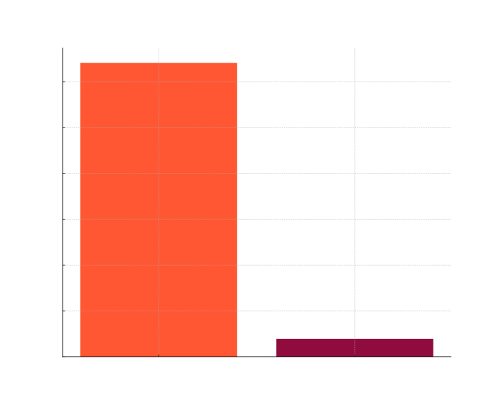
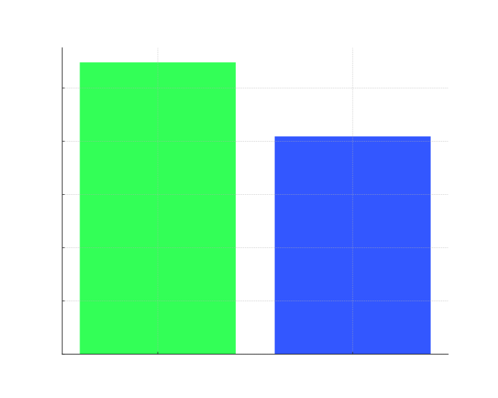

# Tarea Programada II, Entrega I, Estructuras de Datos

Esta tarea consta de un analisis de listas doblemente enlazadas y arboles binarios de busqueda, se pasan por pruebas para ver los tiempos resultantes.
## Pseudocodigos 
### Linked List 
```
LIST-SEARCH(L, k)

1    x = L.head
2    while x ≠ NIL and x.key ≠ k
3        x = x.next
4    return x

LIST-PREPEND(L, x)

1    x.next = L.head
2    x.prev = NIL
3    if L.head ≠ NIL
4        L.head.prev = x
5    L.head = x

LIST-INSERT(x, y)

1    x.next = y.next
2    x.prev = y
3    if y.next ≠ NIL
4        y.next.prev = x
5    y.next = x

LIST-DELETE(L, x)

1    if x.prev ≠ NIL
2        x.prev.next = x.next
3    else L.head = x.next
4    if x.next ≠ NIL
5        x.next.prev = x.prev

LIST-DELETE'(x)

1    x.prev.next = x.next
2    x.next.prev = x.prev

LIST-INSERT'(x, y)

1    x.next = y.next
2    x.prev = y
3    y.next.prev = x
4    y.next = x

LIST-SEARCH'(L, k)

1    L.nil.key = k  // store the key in the sentinel to guarantee it is in list
2    x = L.nil.next // start at the head of the list
3    while x.key ≠ k
4        x = x.next
5    if x == L.nil
6        return NIL // k was not really in the list
7    else return x  // found k in element x

```
### Binary Search Tree
```

INORDER-TREE-WALK (x)

1 if x ≠ NIL
2    INORDER-TREE-WALK (x.left)
3    print x.key
4    INORDER-TREE-WALK (x.right)

TREE-SEARCH (x, k)

1 if x == NIL or k == x.key
2    return x
3 if k < x.key
4    return TREE-SEARCH (x.left, k)
5 else return TREE-SEARCH (x.right, k)

ITERATIVE-TREE-SEARCH (x, k)

1 while x ≠ NIL and k ≠ x.key
2    if k < x.key
3        x = x.left
4    else x = x.right
5 return x

TREE-MINIMUM (x)

1 while x.left ≠ NIL
2    x = x.left
3 return x

TREE-MAXIMUM (x)

1 while x.right ≠ NIL
2    x = x.right
3 return x

TREE-SUCCESSOR (x)

1 if x.right ≠ NIL
2    return TREE-MINIMUM (x.right)
3 else
4    y = x.p
5    while y ≠ NIL and x == y.right
6        x = y
7        y = y.p
8    return y

TREE-INSERT (T, z)

1    x = T.root
2    y = NIL
3    while x ≠ NIL
4        y = x
5        if z.key < x.key
6            x = x.left
7        else x = x.right
8    z.p = y
9    if y == NIL
10       T.root = z
11   elseif z.key < y.key
12       y.left = z
13   else y.right = z

TRANSPLANT (T, u, v)

1    if u.p == NIL
2        T.root = v
3    elseif u == u.p.left
4        u.p.left = v
5    else u.p.right = v
6    if v ≠ NIL
7        v.p = u.p

TREE-DELETE (T, z)

1    if z.left == NIL
2        TRANSPLANT (T, z, z.right)
3    elseif z.right == NIL
4        TRANSPLANT (T, z, z.left)
5    else y = TREE-MINIMUM (z.right)
6        if y ≠ z.right
7            TRANSPLANT (T, y, y.right)
8            y.right = z.right
9            y.right.p = y
10       TRANSPLANT (T, z, y)
11       y.left = z.left
12       y.left.p = y
```
Estos pseudocodigos fueron obtenidos del libro Introduction to Algorithms, IV ed. MIT Press, 2022, teniendo como autores a Cormen, T. H., Leiserson, C. E., Rivest, R. L. y Stein, C., todo el codigo fue implementado tomando como base el pseudocodigo, algunos metodos se omitieron para hacer el codigo mas claro.

### Pruebas

Para la realizacion de pruebas fue creado un main el cual al correrlo muestra salidas como estas:
```
Pruebas de insercion aleatoria:
Tiempo de insercion aleatoria (repeticion 1): 0.054989 segundos
Tiempo de insercion aleatoria (repeticion 2): 0.052722 segundos
Tiempo de insercion aleatoria (repeticion 3): 0.056841 segundos

Pruebas de insercion ordenada:
Tiempo de insercion ordenada (repeticion 1): 0.041593 segundos
Tiempo de insercion ordenada (repeticion 2): 0.041364 segundos
Tiempo de insercion ordenada (repeticion 3): 0.040087 segundos

Pruebas de busqueda tras insercion aleatoria:
Tiempo de busqueda: 26.9922 segundos
Tiempo de busqueda: 28.3276 segundos
Tiempo de busqueda: 28.8458 segundos

Pruebas de busqueda tras insercion ordenada:
Tiempo de busqueda: 29.3746 segundos
Tiempo de busqueda: 27.399 segundos
Tiempo de busqueda: 27.74 segundos
```
Esto para mayor facilidad en la recoleccion de los tiempos. 
### Pruebas realizadas con los siguientes datos
```
const int N = 1000000;
const int E = 10000;
```
Como decia el enunciado, se ejectuaron las tres pruebas correspondientes, con cada estructura e insercion
### Graficos que muestran resultados



### Consideraciones generales
Es importante mencionar que el codigo tiene dos main, ya que uno fue hecho para realizar pruebas de insercion aleatoria y ordenada en el BST y el otro fue para hacer las pruebas de la lista doblemente enlazada. 

### Referencias usadas

- Cormen, T. H., Leiserson, C. E., Rivest, R. L. y Stein, C. Introduction to Algorithms, IV ed. MIT Press, 2022.
- GeeksforGeeks. (2022, December 8). Insertion in Binary Search Tree (BST). GeeksforGeeks; GeeksforGeeks. https://www.geeksforgeeks.org/insertion-in-binary-search-tree/

### Compilacion
```
g++ -fsanitize=address *.cpp *.h -o main
./main
```
### Creditos 
- Andres Murillo Murillo 
- Carnet: C15424