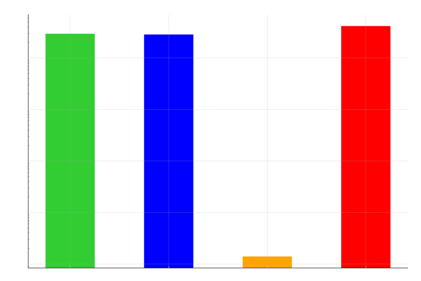

# Tarea Programada II, Entrega I, Estructuras de Datos

Esta tarea consta de un analisis de listas doblemente enlazadas y arboles binarios de busqueda, se pasan por pruebas para ver los tiempos resultantes.
## Pseudocodigos 
### Linked List 
```
LIST-SEARCH(L, k)
1    x = L.head
2    while x ≠ NIL and x.key ≠ k
3        x = x.next
4    return x

LIST-PREPEND(L, x)
1    x.next = L.head
2    x.prev = NIL
3    if L.head ≠ NIL
4        L.head.prev = x
5    L.head = x

LIST-INSERT(x, y)
1    x.next = y.next
2    x.prev = y
3    if y.next ≠ NIL
4        y.next.prev = x
5    y.next = x

LIST-DELETE(L, x)
1    if x.prev ≠ NIL
2        x.prev.next = x.next
3    else L.head = x.next
4    if x.next ≠ NIL
5        x.next.prev = x.prev

LIST-DELETE'(x)
1    x.prev.next = x.next
2    x.next.prev = x.prev

LIST-INSERT'(x, y)
1    x.next = y.next
2    x.prev = y
3    y.next.prev = x
4    y.next = x

LIST-SEARCH'(L, k)
1    L.nil.key = k  // store the key in the sentinel to guarantee it is in list
2    x = L.nil.next // start at the head of the list
3    while x.key ≠ k
4        x = x.next
5    if x == L.nil
6        return NIL // k was not really in the list
7    else return x  // found k in element x

```
### Binary Search Tree
```
INORDER-TREE-WALK (x)
1 if x ≠ NIL
2    INORDER-TREE-WALK (x.left)
3    print x.key
4    INORDER-TREE-WALK (x.right)

TREE-SEARCH (x, k)
1 if x == NIL or k == x.key
2    return x
3 if k < x.key
4    return TREE-SEARCH (x.left, k)
5 else return TREE-SEARCH (x.right, k)

ITERATIVE-TREE-SEARCH (x, k)
1 while x ≠ NIL and k ≠ x.key
2    if k < x.key
3        x = x.left
4    else x = x.right
5 return x

TREE-MINIMUM (x)
1 while x.left ≠ NIL
2    x = x.left
3 return x

TREE-MAXIMUM (x)
1 while x.right ≠ NIL
2    x = x.right
3 return x

TREE-SUCCESSOR (x)
1 if x.right ≠ NIL
2    return TREE-MINIMUM (x.right)
3 else
4    y = x.p
5    while y ≠ NIL and x == y.right
6        x = y
7        y = y.p
8    return y

TREE-INSERT (T, z)
1    x = T.root
2    y = NIL
3    while x ≠ NIL
4        y = x
5        if z.key < x.key
6            x = x.left
7        else x = x.right
8    z.p = y
9    if y == NIL
10       T.root = z
11   elseif z.key < y.key
12       y.left = z
13   else y.right = z

TRANSPLANT (T, u, v)
1    if u.p == NIL
2        T.root = v
3    elseif u == u.p.left
4        u.p.left = v
5    else u.p.right = v
6    if v ≠ NIL
7        v.p = u.p

TREE-DELETE (T, z)
1    if z.left == NIL
2        TRANSPLANT (T, z, z.right)
3    elseif z.right == NIL
4        TRANSPLANT (T, z, z.left)
5    else y = TREE-MINIMUM (z.right)
6        if y ≠ z.right
7            TRANSPLANT (T, y, y.right)
8            y.right = z.right
9            y.right.p = y
10       TRANSPLANT (T, z, y)
11       y.left = z.left
12       y.left.p = y
```
### Red-Black Trees 

``` txt

Left-Rotate(T, x)
1.  y = x.right
2.  x.right = y.left  // turn y's left subtree into x's right subtree
3.  if y.left != T.nil
4.      y.left.p = x  // if y's left subtree is not empty...
5.  y.p = x.p  // then x becomes the parent of the subtree's root
6.  if x.p == T.nil
7.      T.root = y  // x's parent becomes y's parent
8.  elseif x == x.p.left
9.      x.p.left = y  // if x was the root...
10. else 
11.     x.p.right = y  // then y becomes the root
12. y.left = x  // otherwise, if x was a left child...
13. x.p = y  // then y becomes a left child

RB-Insert(T, z)
1.  x = T.root  // node being compared with z
2.  y = T.nil  // y will be parent of z
3.  while x != T.nil
4.      y = x  // descend until reaching the sentinel
5.      if z.key < x.key
6.          x = x.left
7.      else 
8.          x = x.right
9.  z.p = y  // found the location—insert z with parent y
10. if y == T.nil
11.     T.root = z  // tree T was empty
12. elseif z.key < y.key
13.     y.left = z
14. else 
15.     y.right = z
16. z.left = T.nil  // both of z’s children are the sentinel
17. z.right = T.nil
18. z.color = RED  // the new node starts out red
19. RB-Insert-Fixup(T, z)  // correct any violations of red-black properties

RB-Insert-Fixup(T, z)
1.  while z.p.color == RED
2.      if z.p == z.p.p.left  // is z’s parent a left child?
3.          y = z.p.p.right  // y is z’s uncle
4.          if y.color == RED  // are z’s parent and uncle both red?
5.              z.p.color = BLACK
6.              y.color = BLACK
7.              z.p.p.color = RED
8.              z = z.p.p  // case 1
9.          else
10.             if z == z.p.right
11.                 z = z.p
12.                 Left-Rotate(T, z)  // case 2
13.             z.p.color = BLACK
14.             z.p.p.color = RED
15.             Right-Rotate(T, z.p.p)  // case 3
16.     else  // same as lines 3–15, but with “right” and “left” exchanged
17.         y = z.p.p.left
18.         if y.color == RED
19.             z.p.color = BLACK
20.             y.color = BLACK
21.             z.p.p.color = RED
22.             z = z.p.p
23.         else
24.             if z == z.p.left
25.                 z = z.p
26.                 Right-Rotate(T, z)  // case 2
27.             z.p.color = BLACK
28.             z.p.p.color = RED
29.             Left-Rotate(T, z.p.p)  // case 3
30. T.root.color = BLACK

RB-Transplant(T, u, v)
1.  if u.p == T.nil
2.      T.root = v
3.  elseif u == u.p.left
4.      u.p.left = v
5.  else 
6.      u.p.right = v
7.  v.p = u.p

RB-Delete(T, z)
1.  y = z
2.  y.original-color = y.color
3.  if z.left == T.nil
4.      x = z.right
5.      RB-Transplant(T, z, z.right)  // replace z by its right child
6.  elseif z.right == T.nil
7.      x = z.left
8.      RB-Transplant(T, z, z.left)  // replace z by its left child
9.  else 
10.     y = TREE-MINIMUM(z.right)  // y is z’s successor
11.     y.original-color = y.color
12.     x = y.right
13.     if y != z.right
14.         RB-Transplant(T, y, y.right)  // is y farther down the tree?
15.         y.right = z.right  // replace y by its right child
16.         y.right.p = y  // z’s right child becomes y’s right child
17.     else 
18.         x.p = y  // in case x is T.nil
19.     RB-Transplant(T, z, y)  // replace z by its successor y
20.     y.left = z.left  // and give z’s left child to y,
21.     y.left.p = y  // which had no left child
22.     y.color = z.color
23. if y.original-color == BLACK
24.     RB-Delete-Fixup(T, x)  // if any red-black violations occurred, correct them

RB-Delete-Fixup(T, x)
1.  while x != T.root and x.color == BLACK
2.      if x == x.p.left  // is x a left child?
3.          w = x.p.right  // w is x’s sibling
4.          if w.color == RED
5.              w.color = BLACK
6.              x.p.color = RED
7.              LEFT-ROTATE(T, x.p)  // case 1
8.              w = x.p.right
9.          if w.left.color == BLACK and w.right.color == BLACK
10.             w.color = RED  // case 2
11.             x = x.p
12.         else
13.             if w.right.color == BLACK
14.                 w.left.color = BLACK
15.                 w.color = RED
16.                 RIGHT-ROTATE(T, w)  // case 3
17.                 w = x.p.right
18.             w.color = x.p.color
19.             x.p.color = BLACK
20.             w.right.color = BLACK
21.             LEFT-ROTATE(T, x.p)  // case 4
22.             x = T.root
23.     else  // same as lines 3–22, but with “right” and “left” exchanged
24.         w = x.p.left
25.         if w.color == RED
26.             w.color = BLACK
27.             x.p.color = RED
28.             RIGHT-ROTATE(T, x.p)  // case 1
29.             w = x.p.left
30.         if w.right.color == BLACK and w.left.color == BLACK
31.             w.color = RED  // case 2
32.             x = x.p
33.         else
34.             if w.left.color == BLACK
35.                 w.right.color = BLACK
36.                 w.color = RED
37.                 LEFT-ROTATE(T, w)  // case 3
38.             w = x.p.left
39.             w.color = x.p.color
40.             x.p.color = BLACK
41.             w.left.color = BLACK
42.             RIGHT-ROTATE(T, x.p)  // case 4
43.             x = T.root
44. x.color = BLACK

RB-Delete-Fixup(T, x)
1.  while x ≠ T.root and x.color == BLACK
2.      if x == x.p.left  // is x a left child?
3.          w = x.p.right  // w is x’s sibling
4.          if w.color == RED
5.              w.color = BLACK
6.              x.p.color = RED
7.              LEFT-ROTATE(T, x.p)  // case 1
8.              w = x.p.right
9.          if w.left.color == BLACK and w.right.color == BLACK
10.             w.color = RED  // case 2
11.             x = x.p
12.         else
13.             if w.right.color == BLACK
14.                 w.left.color = BLACK
15.                 w.color = RED
16.                 RIGHT-ROTATE(T, w)  // case 3
17.                 w = x.p.right
18.             w.color = x.p.color
19.             x.p.color = BLACK
20.             w.right.color = BLACK
21.             LEFT-ROTATE(T, x.p)  // case 4
22.             x = T.root
23.     else  // same as lines 3–22, but with “right” and “left” exchanged
24.         w = x.p.left
25.         if w.color == RED
26.             w.color = BLACK
27.             x.p.color = RED
28.             RIGHT-ROTATE(T, x.p)  // case 1
29.             w = x.p.left
30.         if w.right.color == BLACK and w.left.color == BLACK
31.             w.color = RED  // case 2
32.             x = x.p
33.         else
34.             if w.left.color == BLACK
35.                 w.right.color = BLACK
36.                 w.color = RED
37.                 LEFT-ROTATE(T, w)  // case 3
38.             w = x.p.left
39.             w.color = x.p.color
40.             x.p.color = BLACK
41.             w.left.color = BLACK
42.             RIGHT-ROTATE(T, x.p)  // case 4
43.             x = T.root
44. x.color = BLACK

```

## Hash Tables

```txt
Hash-Insert(T, k)
1.  i = 0
2.  repeat
3.      q = h(k, i)
4.      if T[q] == NIL
5.          T[q] = k
6.          return q
7.      else 
8.          i = i + 1
9.  until i == m
10. error "hash table overflow"

Hash-Search(T, k)
1.  i = 0
2.  repeat
3.      q = h(k, i)
4.      if T[q] == k
5.          return q
6.      i = i + 1
7.  until T[q] == NIL or i == m
8.  return NIL

Linear-Probing-Hash-Delete(T, q)
1.  while TRUE
2.      T[q] = NIL // make slot q empty
3.      q' = q // starting point for search
4.      repeat
5.          q' = (q' + 1) mod m // next slot number with linear probing
6.          k' = T[q'] // next key to try to move
7.          if k' == NIL
8.              return // return when an empty slot is found
9.      until g(k', q) < g(k', q') // was empty slot q probed before q'?
10.     T[q] = k' // move k' into slot q
11.     q = q' // free up slot q'

WEE(k, a, b, t, r, m)
1.  u = ceil(t / w)
2.  (k1, k2, ..., ku) = chop(k)
3.  q = b
4.  for i = 1 to u
5.      q = f^(r)_(a+2i)(ki + q)
6.  return q mod m

```

Estos pseudocodigos fueron obtenidos del libro Introduction to Algorithms, IV ed. MIT Press, 2022, teniendo como autores a Cormen, T. H., Leiserson, C. E., Rivest, R. L. y Stein, C., todo el codigo fue implementado tomando como base el pseudocodigo, algunos metodos se omitieron para hacer el codigo mas claro.

### Pruebas

Para la realizacion de pruebas fue creado un main el cual al correrlo muestra salidas como estas:
```
Pruebas de insercion aleatoria:
Tiempo de insercion aleatoria (repeticion 1): 0.054989 segundos
Tiempo de insercion aleatoria (repeticion 2): 0.052722 segundos
Tiempo de insercion aleatoria (repeticion 3): 0.056841 segundos

Pruebas de insercion ordenada:
Tiempo de insercion ordenada (repeticion 1): 0.041593 segundos
Tiempo de insercion ordenada (repeticion 2): 0.041364 segundos
Tiempo de insercion ordenada (repeticion 3): 0.040087 segundos

Pruebas de busqueda tras insercion aleatoria:
Tiempo de busqueda: 26.9922 segundos
Tiempo de busqueda: 28.3276 segundos
Tiempo de busqueda: 28.8458 segundos

Pruebas de busqueda tras insercion ordenada:
Tiempo de busqueda: 29.3746 segundos
Tiempo de busqueda: 27.399 segundos
Tiempo de busqueda: 27.74 segundos
```
Esto para mayor facilidad en la recoleccion de los tiempos. 
### Pruebas realizadas con los siguientes datos
```
const int N = 1000000;
const int E = 10000;
```
Como decia el enunciado, se ejectuaron las tres pruebas correspondientes, con cada estructura e insercion
### Tablas de resultados
Estos fueron los resultados en una de las ejecuciones que se realizaron. 
| Prueba                        | 1       | 2       | 3       | Promedio |
|-------------------------------|---------|---------|---------|----------|
| Inserción aleatoria en lista  | 0.0506  | 0.0522  | 0.0519  | 0.0516   |
| Inserción ordenada en lista   | 0.0415  | 0.0413  | 0.0400  | 0.0409   |
| Inserción aleatoria en BST    | 0.6974  | 0.6998  | 0.6816  | 0.6929   |
| Inserción ordenada en BST     | 0.0512  | 0.0505  | 0.0539  | 0.0519   |


| Prueba                        | 1       | 2       | 3       | Promedio |
|-------------------------------|---------|---------|---------|----------|
| Búsqueda aleatoria en la lista| 29.5528 | 28.6725 | 30.3120 | 29.5124  |
| Búsqueda ordenada en la lista | 28.6000 | 28.5617 | 28.5102 | 28.5573  |
| Búsqueda aleatoria en el BST  | 0.0010  | 0.0021  | 0.0011  | 0.0014   |
| Búsqueda ordenada en el BST   | 42.2296 | 41.8137 | 40.8869 | 41.6434  |

### Graficos 



### Consideraciones generales
Es importante mencionar que el codigo tiene dos main, ya que uno fue hecho para realizar pruebas de insercion aleatoria y ordenada en el BST y el otro fue para hacer las pruebas de la lista doblemente enlazada. 

### Referencias usadas

- Cormen, T. H., Leiserson, C. E., Rivest, R. L. y Stein, C. Introduction to Algorithms, IV ed. MIT Press, 2022.
- GeeksforGeeks. (2022, December 8). Insertion in Binary Search Tree (BST). GeeksforGeeks; GeeksforGeeks. https://www.geeksforgeeks.org/insertion-in-binary-search-tree/

### Compilacion
#### ASAN
```
g++ -fsanitize=address *.cpp *.h -o main
./main
```
#### MEMCHECK
```
g++ -g -o test *.cpp *.h
valgrind --leak-check=full --show-leak-kinds=all ./test
```
### Creditos 
- Andres Murillo Murillo 
- Carnet: C15424